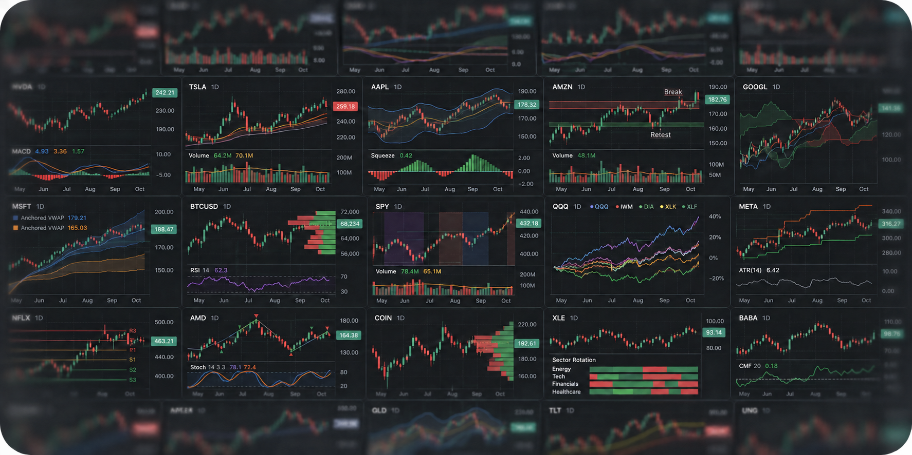

  <picture>
    <source media="(prefers-color-scheme: dark)" srcset="docs/assets/tea-logo-dark.svg">
    
  </picture>

  

  Tea is an open-source language for computation on time-series data.

  <a href="https://openchart.co/tea"><strong>Read the documentation →</strong></a>

## Introduction

Tea is a programming language for computation over data streams. It lets you
express computations whose outputs depend on the current input and previous
inputs, with history and state managed by the language.

You can use Tea to build:

- **Technical indicators:** Combine and transform market data into signals.
- **Trading strategies (coming soon):** Backtesting and live trading workflows
  are not yet available.
- **Market scanners (coming soon):** Live scanning is not yet available.
- **Alerts:** Emit events that a host application can use to trigger external
  actions, such as notifying an AI agent.
- **Time-series prediction:** Express forecasting models and evaluate them
  across datasets and parameter configurations.

### Why Tea

- **Easy to write and read.** Tea's compact syntax lets people and agents focus
  on the calculation. The language handles repeated evaluation, history, and
  retained state, while the host supplies data streams. See
  [Program structure](https://openchart.co/tea/language-guide/program-structure).
- **Built for time-series performance.** Tea evaluates data incrementally and
  retains the history each calculation needs. It uses
  [Apache Arrow](https://arrow.apache.org/) for typed data exchange.
- **Explicit I/O boundaries.** Tea scripts have no direct network or filesystem
  access. The host application controls data access and external actions.
- **Extensible.** Tea supports functions, structs, collections, interfaces, and
  generics for composing reusable calculations. Recursive function calls are
  not supported.
- **Open source.** The compiler, runtime, and standard libraries are developed
  in the open, so you can inspect how the language works and contribute to it.
- **Experimental GPU execution.** Eligible numeric programs compile to WGSL
  and run through WebGPU on compatible devices. Multiple datasets or parameter
  configurations can share the same compiled program. See
  [GPU support and limitations](https://openchart.co/tea/advanced/gpu-lowering).
