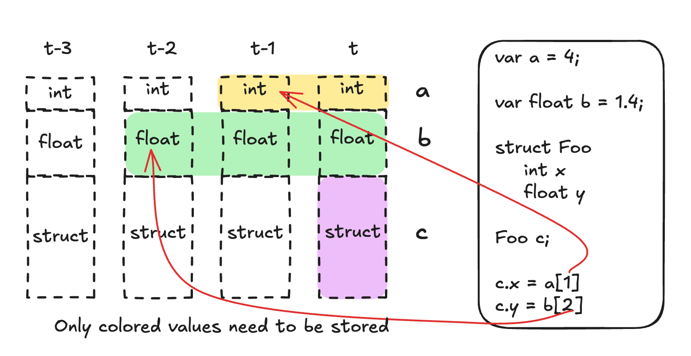

Tea has a **step-by-step** execution runtime. That means a Tea program is
repeatedly executed against a dataset, row by row. Conceptually this is simple.
Consider the following price data:

| index | open | close | high | low |
| ----- | ---- | ----- | ---- | --- |
| 0     | 1.0  | 1.2   | 1.3  | 0.9 |
| 1     | 1.2  | 0.9   | 1.2  | 0.8 |
| 2     | 0.9  | 0.7   | 1.0  | 0.7 |

And a Tea program like this:

```tea
foo = close - open
bar = foo - foo[1]

emit "foo" foo
emit "bar" bar
```

`foo` is the price move within each bar. `bar` measures how that move differs
from the previous bar. The program produces the following values, rounded for
display:

| index | foo  | bar  |
| ----- | ---- | ---- |
| 0     | 0.2  | `na` |
| 1     | -0.3 | -0.5 |
| 2     | -0.2 | 0.1  |

Let's follow the second row. Tea binds `open` to `1.2` and `close` to `0.9`,
then runs the program from top to bottom. `foo` becomes `-0.3`. `foo[1]` is still
`0.2`, the value from the previous row, so `bar` becomes `-0.5`.

On the first row, there is no previous value of `foo`. Its numeric history is
`na` (not available), and the subtraction also produces `na`.

## Where the loop went

The Tea program above, along with the runtime that drives it, can be thought
of as the following Python code:

```python
def run(dataset):
    foo = [None] * len(dataset)
    bar = [None] * len(dataset)

    for i, row in enumerate(dataset):
        foo[i] = row["close"] - row["open"]
        if i > 0:
            bar[i] = foo[i] - foo[i - 1]

        yield {"foo": foo[i], "bar": bar[i]}
```

Here, Python's `None` stands in for Tea's `na`.

Note how the Tea version doesn't explicitly store `foo` in a list or retrieve
it from a state object. Variables carry their history, and we access it through
the **history operator `[]`**: `foo[1]` is one step ago, `foo[2]` is two steps ago.
This works for calculated variables as well as inputs like `close`.

One strength of Tea is being able to express these **temporal dependencies**
succinctly. We write the calculation; Tea handles the loop, the input values,
and the history needed by the program. The Python lists above illustrate the
behavior, rather than how Tea actually allocates memory.

## Input, state, and output

More generally, a Tea program describes a step of a **state-space model**:

$$
h_{t+1} = f(h_t, x_t), \qquad y_t = g(h_t, x_t)
$$

Here, `x` is the current input, `h` is the state retained between steps, and
`y` is the output. At step `t`, the program reads the input and existing state,
calculates its output, and determines the state to carry forward. State can
include previous input values, accumulated totals, or values stored in
collections. The functions `f` and `g` describe the calculation; they are not
functions you must declare in Tea.

For example, suppose a calculation uses the current value and the previous
one, with a different formula when the value is rising. In Python, one way
to make the retained state explicit is:

```python
import math

def step(state, x, theta):
    previous = state["previous"]
    if previous is None:
        result = None
    elif x > previous:
        result = math.sqrt(x * x + previous * previous) * theta
    else:
        result = math.sqrt(abs(x * x - previous * previous)) * theta

    state["previous"] = x
    return result

state = {"previous": None}
for x in [1.0, 2.0, 1.0]:
    print(step(state, x, 1.5))
```

In Tea, the same calculation is:

```tea
x = input.series("x")
theta = input.float(1.5, "Theta")

result = if x > x[1]
    math.sqrt(x * x + x[1] * x[1]) * theta
else
    math.sqrt(math.abs(x * x - x[1] * x[1])) * theta

emit "result" result
```

The application binds a stream with an `x` column. Tea supplies the iteration
and the previous value `x[1]`; the source only describes the calculation.
The first result is `na` because there is no previous sample. The next two
are approximately `3.3541` and `2.5981`.

The equations describe completed steps. A live bar can be evaluated several
times before its state is finalized, as shown below.

## A time dimension for variables

History gives a readable variable a time dimension: `a` is its current value,
`a[1]` is its value one completed step ago, and `a[2]` is two steps ago. This is
the intuition behind the **time machine** illustration below.

The sketch uses pseudocode. Read its columns as values at different steps;
they are a conceptual view of history, rather than a literal stack layout.
The row labeled `struct` holds references to objects, whose behavior is
explained after the example.

{/* Original illustration from https://hackmd.io/FSX1-PtNTT6rdJeURp8gKg; image: https://hackmd.io/_uploads/BJj5j4EwGe.png */}

![History across four steps: a read of a[1] points to the integer at t minus 1, and b[2] points to the float at t minus 2.](../assets/language-guide/history-across-steps.png)

*The red arrows read earlier values of `a` and `b` to construct the current
value of `c`.*

Here is the example in current Tea syntax:

```tea
var int a = 4
var float b = 1.4

struct Foo
    int x
    float y

c = Foo.new(a[1], b[2])
emit "c" c
```

On the first step, both fields are `na`. On the second, `c.x` is `4` but `c.y`
is still `na`. From the third step onward, they are `4` and `1.4`.

History belongs to the **binding**. For numbers, it preserves the previous
number. For collections, it preserves the earlier collection contents. For
structs, it preserves the earlier reference: `c[1]` reaches the object that
`c` referred to, and that object's fields can still be mutated. It does not
freeze a copy of every object in the program. Collections containing structs
also retain references to those live objects. See
[history and references](../memory-model.md#history-versions-bindings).

To keep the history of a field or expression, first give its value a binding:
`x = c.x`, then `x[1]`. `c.x[1]` and `(high + low)[1]` are not valid history
reads. `const` bindings have no history.

## Keeping only the history that is needed

The time dimension does not require saving the whole program at every step.
When a history offset is known before execution, Tea can determine how far
back that binding needs to reach. The highlighted version of the sketch shows
the logical windows needed by this example:

{/* Original illustration from https://hackmd.io/FSX1-PtNTT6rdJeURp8gKg; image: https://hackmd.io/_uploads/Bykl3NVwzx.png */}



| Binding | Furthest read | Values in the illustrated window |
| ------- | ------------- | -------------------------------- |
| `a`     | `a[1]`        | Current value and one previous value |
| `b`     | `b[2]`        | Current value and two previous values |
| `c`     | Current only  | Current reference |

Why keep the middle value of `b` if the program only reads `b[2]`? At step
`t`, the value from `t - 1` is not used by that read. At the next step, it
becomes the value two steps ago. A rolling history must keep it until then.

Tea also accepts offsets calculated during execution. Those reads are bounded
by the variable's retained history, normally 500 steps or more if another read
requires a deeper window. Reading beyond the available history produces the
type's empty value. See the
[history operator](../reference/language/expressions.md#history-) for exact
offset rules.

Collections use persistent storage so historical versions can share unchanged
backing instead of copying everything at every step. Tea also disallows
recursive function calls, keeping the call structure known ahead of execution.
The [memory model](../memory-model.md) explains value behavior, and the
[runtime](../runtime.md) describes its physical implementation.

## Recalculating and remembering

`foo = close - open` is evaluated again on every row. If we want a value to carry
forward and accumulate, we use `var`:

```tea
var float total = 0.0
total := total + (close - open)
emit "total" total
```

For the three rows above, `total` is `0.2`, then `-0.1`, then `-0.3`.
`var` initializes it once; `:=` updates the existing value. We can still read
`total[1]` to get its value on the previous completed step.

## Historical data and live updates

The same calculation can run over historical bars or receive live data as it
arrives. The application supplies the data; the Tea program describes what to do
with each step.

There is one extra detail with live bars: the latest bar may change several
times before it closes. Tea reevaluates that same bar. `close` reflects the
latest update, while `close[1]` still refers to the previous completed bar.
History advances when the current bar is finalized.

Continue the opening `foo` and `bar` example after index `2`, where the last
completed `foo` was `-0.2`. Three updates of the next bar might look like this
(values rounded for display):

| Arrival | Logical index | open | close | Status | foo | foo[1] | bar |
| ------- | ------------- | ---- | ----- | ------ | --- | ------ | --- |
| First update | 3 | 1.1 | 0.8 | Provisional | -0.3 | -0.2 | -0.1 |
| Next update | 3 | 1.1 | 0.7 | Provisional | -0.4 | -0.2 | -0.2 |
| Bar closes | 3 | 1.1 | 0.9 | Final | -0.2 | -0.2 | 0.0 |

All three attempts have index `3`. `foo[1]` stays on index `2`, even though
`foo` changes. Only the final attempt advances history, so index `4` will read
the finalized `-0.2` as its previous `foo`.

For a numeric variable such as `total`, `var` updates are rolled back between
updates of the same bar. `varip` keeps those updates instead. This distinction
matters when counting price updates rather than completed bars. Use
`barstate.isconfirmed` for logic that should run only when a bar closes.

Each successful attempt publishes its outputs. An execution failure publishes
nothing and stops the run. The application decides how to display or retain
provisional outputs. Historical and live inputs can use the same calculation;
live scanning and live trading workflows are
[coming soon](../getting-started/live-trading.md).

The [memory model](../memory-model.md#transactions-realtime-var-and-varip)
covers these live-state rules in detail, including how objects behave.
