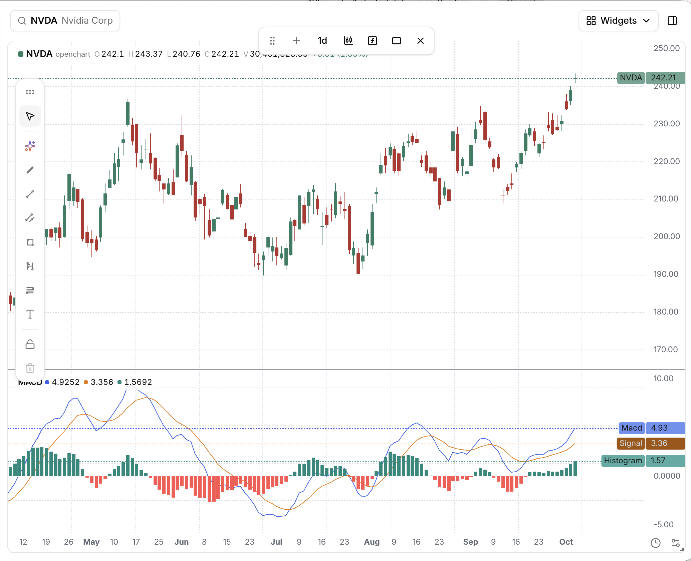

A Tea program describes what to calculate for one step of a data stream.
The application supplies the data, and Tea runs the calculation as each row
arrives. Parameters configure the calculation; variables hold current values
and retained state; outputs carry the results back to the application.

Let's write a program that keeps a running score as prices arrive. The rule is
simple: when the price is above a threshold, add the difference multiplied by a
`gain`; when it's below, subtract the difference. At the threshold, leave the
score unchanged.

Save this as `score.tea`:

```tea
gain = input.float(1.5, "Gain")
threshold = input.float(10.0, "Threshold")

var float score = 0.0
if close > threshold
    score := score + (close - threshold) * gain
else if close < threshold
    score := score - (threshold - close)

regime = close > threshold ? 1 : close < threshold ? -1 : 0

emit "score" score
plot("score-plot", score, "Running score")
plot("regime-plot", regime, "Regime")
```

That's the whole program. Let's go through it.

## Inputs

There are two kinds of inputs here. `gain` and `threshold` are **parameters**:
values we choose before a run. Their defaults are `1.5` and `10.0`. We can run
the same program with a different gain without editing the calculation.

`close` is a **time-series input**. It takes its value from the row currently
being processed. On price bars, that's the closing price. The application
running Tea supplies this data; the script doesn't need to open a CSV file or
connect to a market-data service.

The variable name `gain` identifies the parameter. The string "Gain" is its
label, which an application can show in a settings panel.

## Calculation and state

`score` starts at zero. The `var` keyword initializes it once, when execution
first reaches the declaration, and keeps its value for the next step. `:=`
updates that value. With `gain = 1.5` and `threshold = 10`, a stream of
completed rows produces:

| index | close | Change to score | score | regime |
| ----- | ----- | --------------- | ----- | ------ |
| 0     | 8     | -2              | -2    | -1     |
| 1     | 12    | +3              | 1     | 1      |
| 2     | 15    | +7.5            | 8.5   | 1      |
| 3     | 9     | -1              | 7.5   | -1     |
| 4     | 10    | 0               | 7.5   | 0      |
| 5     | 14    | +6              | 13.5  | 1      |

`regime` is calculated again on each step: `1` above the threshold, `-1` below,
and `0` at it. The `? :` expression chooses between these values. Tea infers its
type; the `float` annotation on `score` explicitly makes it a floating-point value.

Blocks use indentation. The two statements under `if` and `else if` run only
when their respective conditions are true.

There is no outer loop over prices in this source. Tea supplies that loop and
retains the values needed between steps. The
[execution model](./execution-model.md) follows those steps in detail.

## Outputs

`emit "score" score` produces the numeric score for this step. The two `plot`
calls produce descriptions of what to draw. An application can turn these into
chart lines, while another application might just collect the numeric output.

The first argument to `plot` is a stable output ID, the second is the value,
and the third is a display title. `plot` is available without an import.

An ordinary Tea program can produce numbers, plots, and events together.
As it grows, we can move calculations into [functions](./values-and-control-flow.md#functions-and-loops)
or [libraries](../imports.md).

## Optional chart metadata

An entry may begin with an `indicator()` header that tells a host how to show
it: a title, whether to draw over the price chart, and, with
`timeframe = "auto"`, that the host may run it on finer bars of the same
symbol. It must be the first statement, appear once, and use literal
arguments with a non-empty title. Tea runs the program the same way with or
without it, and there is no `strategy()` header.

```tea
indicator("RSI", overlay = false)
length = input.int(14, "Length", minval=1)
plot("rsi", ta.rsi(close, length), "RSI")
```

## From a calculation to an indicator

MACD is another example of the same structure: choose parameters, transform
the price stream, and publish the results. A fast and a slow exponential moving
average produce the MACD line; an average of that line produces the signal;
their difference produces the histogram.

```tea
indicator("MACD", overlay = false)

fastLength = input.int(12, "Fast length", minval=1)
slowLength = input.int(26, "Slow length", minval=1)
signalLength = input.int(9, "Signal length", minval=1)

macd = ta.ema(close, fastLength) - ta.ema(close, slowLength)
signal = ta.ema(macd, signalLength)
histogram = macd - signal
histogramColor = histogram >= 0 ? color.teal : color.red

hline("zero", 0, "Zero")
plot("histogram", histogram, "Histogram", color=histogramColor, style=plot.style_histogram)
plot("macd", macd, "MACD", color=color.blue)
plot("signal", signal, "Signal line", color=color.orange)

alertcondition("positive", histogram[1] <= 0 and histogram > 0,
    "MACD turns positive", "MACD histogram crossed above zero")
```

The alert compares the current histogram with its previous value,
`histogram[1]`. It emits an event on a crossing; the application decides how
to deliver that event. No plotting loop or notification service belongs in
the calculation.



*MACD displayed in OpenChart: the blue MACD line, orange signal line, and
green/red histogram appear below the daily price chart.*

Tea's syntax is inspired by Pine Script, including the history operator `[]`.
Tea's plotting calls also take a stable output ID first, as shown above.
See [Pine compatibility](../reference/pine-compatibility.md) when adapting an
existing Pine script.

## Life cycle of a Tea program

There are three stages to running this program:

1. **Compilation:** Tea loads the source and its imports, checks it, and builds
   one Program. The CPU backend lowers that Program to TypeScript for execution
   in JavaScript; the GPU backend consumes the same Program.
2. **Binding:** the application supplies parameter values and input data streams.
   The JavaScript API returns a new configured Node, leaving the original
   unchanged. Binding does not start reading data.
3. **Execution:** the first observer starts the Node. It subscribes to the
   bound streams, evaluates the program as data arrives, and publishes outputs.

Here is the complete JavaScript setup for `score.tea`. Run it from the directory
containing that file, with the Tea package available:

```js
import {readFileSync} from 'node:fs';
import {Field, Float64, Schema} from 'apache-arrow';
import {from} from 'rxjs';
import {DataStream, StdoutSink, tea} from 'tea';

// Compile the Tea source. No data is consumed yet.
const source = readFileSync('score.tea', 'utf8');
const node = tea`${source}`;

// Describe the input column and supply six completed rows.
const schema = new Schema([new Field('close', new Float64(), false)]);
const prices = new DataStream(
  schema,
  from([
    {close: 8},
    {close: 12},
    {close: 15},
    {close: 9},
    {close: 10},
    {close: 14},
  ]),
);

// Keep the Node returned by each bind().
const configured = node.bind({gain: 1.5, threshold: 10}).bind(prices);

// The first observer starts execution and prints each output row.
configured.to(new StdoutSink());
```

The Arrow schema describes the shape of each input row. `from()` supplies a
finite stream, so all six rows run and the observer completes. The printed
output includes the numeric score and the two plot descriptions for each row;
the score values match the table above.

For a longer-lived stream, `configured.dispose()` stops the run and releases
its subscriptions. The application owns acquiring the data and deciding when
to stop; Tea owns evaluating the program and maintaining its state.

This separation lets us use the same source with another dataset or another set
of parameters. The [execution model](./execution-model.md) shows what that
repeated evaluation actually looks like.
